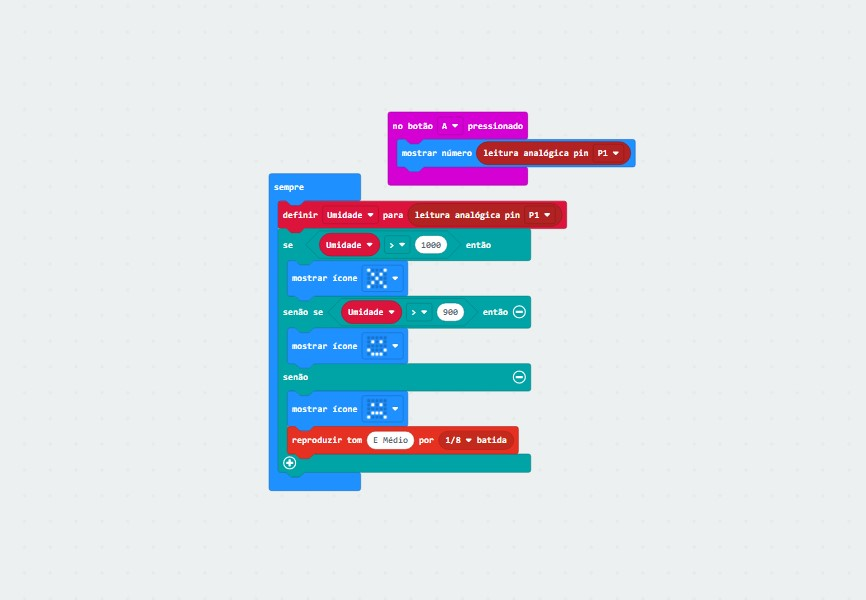

# IoT-arduino-microbit
Projeto simples para curso de extensão - IoT e edge computing para iniciantes na prática com Microbit e Arduíno

Optei por fazer no MicroBit por ser meu primeiro contato com arduíno/microbit e por achar mais intuitívo. Optei por usar o sensor de umidade já disponível na placa e, com base em valores "padrões", definir se uma planta precisa ou não de mais umidade. Claro, os valores podem ser alterados conforme necessidade de cada tipo de planta etc.

Segue abaixo imagem do esquema no microbit.org:

<a href="JavaScriptMicrobit.txt"> Clique aqui para o código em JS </a>
